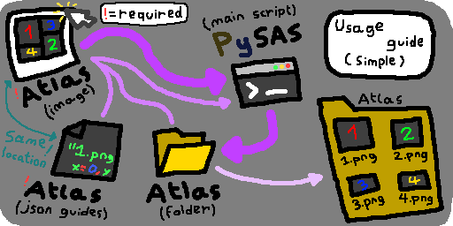

# PySAS

Command line tool for slicing a sprite atlas written in python.

(PySAS = **Py**thon **S**prite **A**tlas **S**licer)

# Sections

* [Pre-Requisits](#pre-requisits)
* [Downloading](#downloading)
* [Installing Dependencies](#installing-dependencies)
* [How To Use (Simple)](#how-to-use-simple)
* [How To Use (Advanced)](#how-to-use-advanced)
* [License](#license)

# Pre-Requisits

This project has been written with Python v3.12.

If you don't have Python already installed, Head to the [Python official website](https://www.python.org/), download a version that is equal or higher to the version this project was written in, and install it **(Don't forget to add python to PATH during installation!)**, and restart your computer after the installation.

# Downloading

You can download this by [[clicking here]](https://github.com/Yukki64/PySAS/archive/refs/heads/main.zip),

Click the green "[<> Code v]" button, and select "Download ZIP",

Or using the "git clone" command if you have git installed on your computer.

 

Once you have it downloaded, extract the zip folder, and follow the steps for [installing dependencies](#installing-dependencies).

# Installing Dependencies

open a terminal emulator, type "pip install -r " in your terminal, and drag "requirements.txt" into your terminal. If you don't know where that file is located, It is in the previously extracted zip folder mentioned in the [downloading section](#downloading).

Once that is done, choose how you want to use this between the [simple methode](#how-to-use-simple) or the [advance methode](#how-to-use-advanced).

# How to use (Simple)

It is as simple as dragging your sprite atlas onto "main.py".

Assuming you drag "atlas.png" onto it, there must be "atlas.json" next to "atlas.png".

Both must be valid files following the formats procured in the "Atlases" folder.

(Image can be any size, json layout must follow but can include extra information)

 

If the folder doesn't exist beside the sprite atlas, it will automatically be created for you next to your sprite atlas.

And if said folder already exists but is not empty, you will be asked if you want to continue.

But if said folder is empty, it will proceed without asking.

 

**You can try with "demo.png" in the procured "Atlases" folder!**

 

Here's a picture depicting the process:



# How to use (Advanced)

Run "main.py" in a terminal emulator and uses these arguments:

| Arguments | Required? | Descriptions |
| ---------- | ---------- | ---------- |
| -h / --help | Only | shows help information |
| spriteAtlas | Yes | any valid sprite atlas image file |
| -j / --json JSON | No | indicate where sprite atlas JSON file is located |
| -o / --output OUTPUT | No | the folder location at which sliced sprites will be output to |
| -s / --silent | No | disable terminal output, don't prompt when action is needed |
| -v / --verbose | No | print execution in terminal |

Exemple (Can be ran by setting terminal's current directory to the location of "main.py"):

```
main.py Atlases\demo.png -j Atlases\demo.json -o Atlases\demo -s -v
```

# License

This software is released under the GPL 3.0, and other third party licenses.
